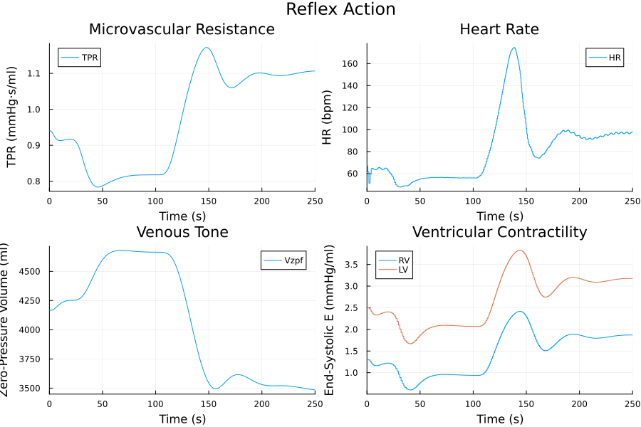

# Cardiopulmonary Model

**Version:** 3.4.0 
**Release Date:** May 21st, 2025 
**Lab:** BXS Lab, UC Davis 
**Authors:** R.S. Whittle, A.J. Kondoor, H.S. Vellore 
**Contact:** 
Dr. Rich Whittle 
Department of Mechanical and Aerospace Engineering 
University of California, Davis 
One Shields Avenue, Davis, CA 95616 
📧 rswhittle@ucdavis.edu 

---

## Overview

This repository contains a simulation of the human cardiopulmonary system developed using [ModelingToolkit.jl](https://mtk.sciml.ai/stable/) in Julia. The model includes:

- Cardiovascular model
    - Four chamber heart
    - Dynamic valves (Mynard)
    - Arterial and venous system (including nonlinear pressure-volume relationship in large veins and vascular collapse mechanics)
    - 6 branches (head/brain, upper body, coronary, renal, splanchnic, lower body) with hydrostatic dependence
    - External tissue pressure
    - Hydrostatically dependent pulmonary circulation based on zonal flow through the lungs
- Pulmonary model
    - Four chamber lung model
    - Dynamic pleural pressure based on breathing rhythm
- Gas exchange
    - Lung and tissue oxygen and carbon dioxide exchange
- Respiratory control
    - Peripheral chemoreceptors
    - Central chemoreceptors
- Cardiovascular control
    - Arterial baroreflex
    - Cardiopulmonary reflex
    - Pulmonary stretch reflex
    - Peripheral chemoreceptors
    - CNS Ischemic Response
    - Cerebral, coronary, and muscular autoregulation

*Figure: Arterial Baroreflex and Cardiopulmonary Reflex action on arteriole resistance, heart rate, venous tone, and ventricular contractility in a 90° stand test.*

## Simulation Scenarios

The model supports simulation of:

- Tilt-angle protocols
- Altered-gravity environments
- Lower body negative pressure (LBNP) protocols

*Figure: Interstitial volume (90° stand test), left heart pressures, cardiac elastances, and ventricular outflow.*

## Model Basis

The mathematical formulation is based on prior work by:

- Ursino (2000, 2002)
- Magosso (2001)
- Heldt (2004)
- Zamanian (2007)
- Mynard (2012)
- Diaz Artiles (2015)
- Albanese (2016)
- Whittle (2023)

---

## License

This project is licensed under the [MIT License](LICENSE).

## DOI

