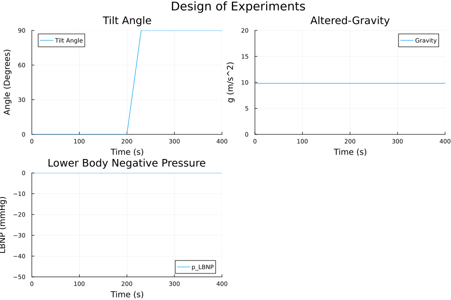
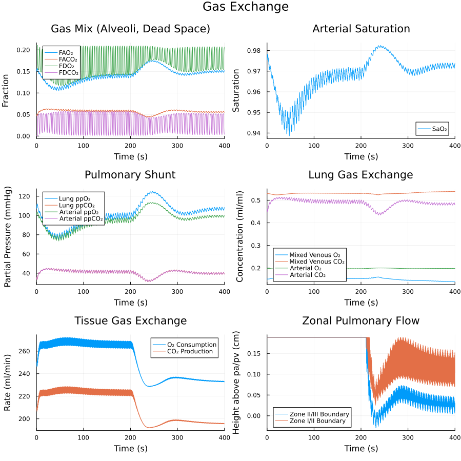

# Cardiopulmonary Model

**Version:** 3.4.0<br>
**Release Date:** May 21st, 2025<br>
**Lab:** BXS Lab, UC Davis<br>
**Authors:** R.S. Whittle, A.J. Kondoor, H.S. Vellore<br>
**Contact:**<br>
Dr. Rich Whittle<br>
Department of Mechanical and Aerospace Engineering<br>
University of California, Davis<br>
One Shields Avenue, Davis, CA 95616<br>
📧 rswhittle@ucdavis.edu<br>

---

## Overview

This repository contains a simulation of the human cardiopulmonary system developed using [ModelingToolkit.jl](https://mtk.sciml.ai/stable/) in Julia. The model includes:

- Cardiovascular model
    - Four chamber heart
    - Dynamic valves (Mynard)
    - Arterial and venous system (including nonlinear pressure-volume relationship in large veins and vascular collapse mechanics)
    - 6 branches (head/brain, upper body, coronary, renal, splanchnic, lower body) with hydrostatic dependence
    - External tissue pressure
    - Hydrostatically dependent pulmonary circulation based on zonal flow through the lungs
- Pulmonary model
    - Four chamber lung model
    - Dynamic pleural pressure based on breathing rhythm
- Gas exchange
    - Lung and tissue oxygen and carbon dioxide exchange
- Respiratory control
    - Peripheral chemoreceptors
    - Central chemoreceptors
- Cardiovascular control
    - Arterial baroreflex
    - Cardiopulmonary reflex
    - Pulmonary stretch reflex
    - Peripheral chemoreceptors
    - CNS Ischemic Response
    - Cerebral, coronary, and muscular autoregulation


## Simulation Scenarios

The model supports simulation of:

- Tilt-angle protocols
- Altered-gravity environments
- Lower body negative pressure (LBNP) protocols



*Figure: Design of experiments showing a 90° stand test at 200 seconds under terrestrial gravity.*

## Images


*Figure: Major cardiovascular control effectors: arteriole resistance, venous tone, heart rate, and ventricular contractility.*


*Figure: Detail of the reflex model showing efferent pathways for the arterial baroreflex, cardiopulmonary reflex, pulmonary stretch reflex, peripheral chemoreceptors, and CNS ischemic offset. Cerebral autoregulation is also demonstrated (note: autoregulation is also applied to the coronary and skeletal muscle microcirculations).*


*Figure: Major hemodynamics showing interstitial volume change in tilt, and detail of elastances, arterial pressure waveform and ventricular outflow demonstrating valve action.*


*Figure: Beat to beat hemodynamics for a 90° stand test. Note: for this WIP release the parameters still need to be tweaked to reduce pressure in supine and better maintain it in tilt.*


*Figure: Average compartment volumes during stand test. Note the rise in volumes in the lower body, fall in venous return, and maintenance of head blood flow due to cerebral autoregulation.*


*Figure: Pulmonary Mechanics.*



*Figure: Gas exchange dynamics showing fractional concentrations of oxygen and carbon dioxide in the dead space and alveoli, arterial saturation, the pulmonary shunt, dynamic tissue demand, and zonal blood flow in the lungs.*

## Model Basis

The mathematical formulation is based on prior work by:

- Ursino (2000, 2002)
- Magosso (2001)
- Heldt (2004)
- Zamanian (2007)
- Mynard (2012)
- Diaz Artiles (2015)
- Albanese (2016)
- Whittle (2023)

---

## License

This project is licensed under the [MIT License](LICENSE).

## DOI

[](https://doi.org/10.5281/zenodo.15338311)

## Citation

Whittle RS, Kondoor AJ, Vellore HS. BXS-Lab/CVModel: v3.4.0. Zenodo; 2025. doi: [10.5281/zenodo.15486814](https://doi.org/10.5281/zenodo.15486814).

### BibTeX

```bibtex
@software{whittle2025cvmodel,
  author       = {Whittle, R. S. and Kondoor, A. J. and Vellore, H. S.},
  title        = {BXS-Lab/CVModel: v3.4.0},
  year         = 2025,
  publisher    = {Zenodo},
  doi          = {10.5281/zenodo.15486814},
  url          = {https://doi.org/10.5281/zenodo.15486814}
}
